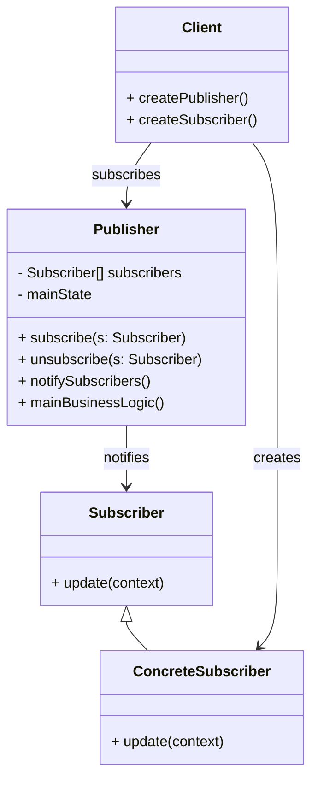

## Obersevações

#### estrutura do padrão

```mermaid
classDiagram
    class Publisher {
        - Subscriber[] subscribers
        - mainState
        + subscribe(s: Subscriber)
        + unsubscribe(s: Subscriber)
        + notifySubscribers()
        + mainBusinessLogic()
    }

    class Subscriber {
        + update(context)
    }

    class ConcreteSubscriber {
        + update(context)
    }

    class Client {
        + createPublisher()
        + createSubscriber()
    }

    Publisher --> Subscriber : notifies
    Subscriber <|-- ConcreteSubscriber
    Client --> Publisher : subscribes
    Client --> ConcreteSubscriber : creates

```
